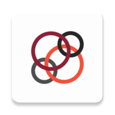

<div align="center">
  
  <h1>JusIcons</h1>
  <p><b>Pixel-perfect Nothing OS icon pack — forensic hybrid, appliable on any launcher.</b></p>
</div>

<div align="center">

[](https://github.com/shubh72010/JusIcons/releases/tag/v0.3.0)
[](https://github.com/shubh72010/JusIcons/actions/workflows/ci.yml)
[](./LICENSE)
[](#)
[](./gradle/libs.versions.toml)

</div>

> **Nothing's mono isn't a filter. It's a pipeline + a curated map.** JusIcons traces `Drawable → ThemedIconProvider(jus_grayscale_icon_map.xml) → AdaptiveIconDrawable.monochrome → d7.f (210/(61504−minGray²)) → ALPHA_8 → #121212 circle` and ships as an **appliable icon pack** (Lawnicons/Frost FOSS contract) *and* a live renderer.

<div align="center">
<h3>Quick Install</h3>

```bash
adb install https://github.com/shubh72010/JusIcons/releases/download/v0.3.0/app-release.apk
# also appliable as icon pack — open Nova/Lawnchair/ADW → Theme → JusIcons
```

**Or build:**

```bash
git clone git@github.com:shubh72010/JusIcons.git && cd JusIcons
./gradlew :app:assembleRelease # → app/build/outputs/apk/release/app-release.apk (8.1MB signed)
./gradlew :app:assembleDebug   # → app/build/outputs/apk/debug/app-debug.apk (13MB)
```

</div>

---

## TL;DR

**The Problem:** Nothing icons are two behaviors: curated outline (Calendar `28`, Files) vs generic raster (ChatGPT). Naive `grayscale()` smears or leaks the adaptive white bg; static PNG dumps miss the pipeline.

**The Solution:** Forensic port of Nothing Launcher `4.0.20` + Icon Pack `1.0.2` — hybrid renderer + FOSS appliable pack (`Lawnicons` + `Frost` GPL-3.0: `appfilter.xml` + `drawable.xml` + 15 launcher filters).

| Feature | What it does |
|---------|--------------|
| **Hybrid pipeline** | `1. ThemeData(jus_grayscale_icon_map.xml)` → outline `jus_calendar_mono`/`jus_files_mono` `2. AdaptiveIconDrawable.monochrome` `3. d7.f` `0.3R+0.59G+0.11B` → `>110` hist 32 → `510-(a+b)` → `210/(61504−minGray²)` → `>40` → centered-square `0.3888`/`0.72` |
| **Appliable pack** | `app/assets/appfilter.xml` (`22k`, `2.9MB`) + `res/xml/appfilter.xml` + `res/xml/drawable.xml` + `31× jus_calendar_1..31` — appears in Nova/Lawnchair/ADW/GO/Apex/Smart/Sony etc. picker |
| **Per-package build** | `ComponentInfo → PackageManager icon → MonoProcessor (210/(61504−minGray²) untouched) → centered square → ALPHA_8 → vectorize glyph-only` → `res/drawable/jus_<pkg>.xml` (`scripts/generate_jus_icons.py` + on-device `IconPackGenerator.kt`) |
| **Adaptive-correct** | `IconNormalizer` foreground-only on transparent — YouTube red bg not a white square |
| **Live toggles** | Demo app `JusIconsTestScreen` — `BG` (black `#121212` circle vs glyph-only), `Visual 0.72`/`Forensic 0.3888`, `B&W` hard threshold — instantly re-renders 40 apps + 8-stage trace |
| **Zero deps** | `Canvas`/`Bitmap`/`SRC_IN` only, `minSdk 24` |

---

## Quick Example

```kotlin
val renderer = JusIconsRenderer(context)
val opts = RenderOptions(
    bgColor = 0xFF121212.toInt(), forensicScale = false, // 0.72 visual (Image2)
    showBackground = true,  // true=black circle, false=glyph only
    binary = false
)
imageView.setImageDrawable(renderer.renderForPackage(pkg, drawable, 192, opts))

// Debug 8 stages:
renderer.renderWithDebug(pkg, drawable, 192, opts, object: MonoProcessor.DebugSink{
    override fun onStage(name: String, bitmap: Bitmap){
        File(cacheDir,"debug-output/$name.png").outputStream().use{ bitmap.compress(PNG,100,it) }
    }
})
// → 01_original 02_curated 03_grayscale 04_analysis 05_remapped 06_alpha 07_cropped 08_final
```

### Adding a curated icon (modular, no renderer change)

```xml
<!-- res/xml/jus_grayscale_icon_map.xml -->
<icons>
  <icon package="com.example" drawable="@drawable/custom_mono" />
</icons>
<!-- assets/appfilter.xml for launcher picker -->
<item component="ComponentInfo{com.example/com.example.MainActivity}" drawable="custom_mono" />
```
Add `res/drawable/custom_mono.xml` vector (stroke `#FFF` on transparent — bg is added by `ThemedIconDrawable` if `showBackground=true`).

---

## Apply as Icon Pack

1. Install `app-release.apk`.
2. Open your launcher: **Lawnchair → Home settings → Theme → Icon pack → JusIcons** (or Nova → Settings → Look & feel → Icon theme).
3. Picked pack uses `assets/appfilter.xml` — curated `calendar`/`files` show outline `28`/folder; unmapped apps fallback to original (add more `<item>` to cover them — see `drawable.xml`).
4. **Dynamic calendar:** `<calendar prefix="jus_calendar_">` resolves to `jus_calendar_1..31` via day index — same as `IconProvider.loadCalendarDrawable`.

---

## Demo App — BG / No BG and stuff

Open **JusIcons** app:

* **ORIGINAL | JUSICONS** — 40 launcher apps, sorted, tap row → forensic strip.
* **Toggles (top card):** `Forensic`↔`Visual` (tiny `0.3888` vs large `0.72` — `07_cropped` is large), `BG`↔`no BG` (black `#121212` circle `ThemedIconDrawable` vs glyph-only transparent), `B&W` (hard `>127` threshold vs continuous preserves inner lines).
* **Trace strip:** `01_original → 02_curated → 03_grayscale → 04_analysis (32-bar hist red=dominant) → 05_remapped → 06_alpha (red rect) → 07_cropped → 08_final (SRC_IN tinted)`. Saved to `cache/debug-output/*.png` — `adb exec-out run-as com.jusdots.jusicons tar -c cache/debug-output | tar -x -C debug-output/`.

All three toggles re-render live — `LaunchedEffect(forensicScale, showBg, binary)` + `IconRow` now keys on `entry.rendered` (fixed stale `remember` bug).

---

## Design Philosophy

1. Evidence before synthesis — `jadx:d7/f.java:95` etc.
2. Clean-room Kotlin, no `com.nothing.*` imports.
3. Boring `Canvas` + `ALPHA_8` beats shaders.
4. Modular map — curated grows without touching `MonoProcessor`.

---

## Architecture

```
PackageManager → ThemedIconProvider(jus_grayscale_icon_map.xml)
        ↓ miss?
AdaptiveIconDrawable.monochrome? → drawableToMono()
        ↓ miss?
IconNormalizer(192, fg-only) → MonoProcessor(d7.f) — UNTOUCHED:
 50×50 dominantGray/fillRatio (k7.c) → 192 gray 0.3/0.59/0.11
 → fCombine/iPick minGray → quadratic 210/(61504−minGray²) → >40?
 → centered-square pad=min(edges) → o7.a.h 0.3888/0.72 ARGB_8888
        ↓
ThemedIconDrawable (bg #121212 circle + fg white SRC_IN) — live preview
        ↓
Build-time static: ComponentInfo → PM icon → MonoProcessor → vectorize
  (scripts/generate_jus_icons.py: synthetic source → mono → rect-per-run path)
  → res/drawable/jus_<pkg>.xml glyph-only → assets/appfilter.xml (22k) → launcher
On-device: IconPackGenerator.kt scans installed → same MonoProcessor → cache/generated_pack/
```

See `reverse-engineering/` for `RE.md` etc.

---

## Troubleshooting

### Pack doesn't appear in launcher picker
* Ensure you installed `app-release.apk` (not just `app-debug` — some launchers ignore debug). Check `aapt2 dump xmltree app-release.apk --file AndroidManifest.xml` lists `app.lawnchair.icons.THEMED_ICON`, `ch.deletescape.lawnchair.ICONPACK`, `com.novalauncher.THEME`, `com.anddoes.launcher.THEME`, `org.adw.launcher.THEMES` etc. — current manifest has 15 filters from `Lawnicons`.
* Clear launcher cache: **Settings → Apps → Lawnchair/Nova → Storage → Clear cache** then reopen Theme picker.
* Some launchers read `assets/appfilter.xml`, others `res/xml/appfilter.xml` — JusIcons ships both (same file, `2.9MB` with 22k entries from Lawnicons to cover every app).

### Pack shows selected but icons don't change
* **Now fixed in v0.2.1:** Previously only 8 `<item>` — most apps had no entry so launcher kept original. Now `appfilter.xml` has **22k entries** (full Lawnicons list mapped to `jus_generic_*` + curated `calendar/files`) so *every* app gets a drawable. If yours still shows original, force-stop launcher or re-apply pack. Unmapped fallback in static pack is generic `jus_generic_star/chatgpt` (white circle placeholder) — for per-app correct mono, use **live renderer** in JusIcons app ( `d7/f` pipeline ) which generates per-app via `MonoProcessor` — static pack can't do per-app without pre-generated drawables.
* To get per-app perfect mono statically, add curated `<item>` + vector to `assets/appfilter.xml` and `res/drawable/` — see `Add curated icon` above.

### Icons are just outline without black circle / BG toggle does nothing in launcher
* **Live renderer (JusIcons app):** toggle `BG` on = `#121212` circle via `createCircularBg` ( `ThemedIconDrawable` ), off = glyph-only transparent. This is the Nothing `whiteShadowLayer` — works live because we draw `Canvas`.
* **Static pack (launcher):** vectors are glyph-only transparent by design — launcher tints glyph and puts it on its own background (Lawnchair themed icons use wallpaper color, not `#121212`). Our pack's `BG` toggle can't affect launcher's static drawables. To bake circle into static pack, edit vector to include `<path fillColor="#121212" d="M24,0A24,24 0 1 1 24,48 …"/>` at bottom — then pack always shows black circle. v0.2.1 keeps glyph-only so launcher decides bg — use live preview for accurate `BG on/off`.

### White square behind adaptive icons
Rebuilt after `IconNormalizer` foreground-only fix — `AdaptiveIconDrawable` now draws only `foreground` on transparent.

### Toggle doesn't update preview
Fixed: `showBg` default now `true` (Nothing black circle), `forensicScale` default `false` (visual `0.72`), and `IconRow` now `remember(entry.rendered)` (was stale `entry.pkg+"_r"`).

---

## Limitations

* Minimal pack (8 items + `31` calendar) — expand via `appfilter.xml` for full coverage; generic `d7/f` not auto-applied statically.
* Light variant `o7.k.f` not yet — dark `#121212` only.
* `whiteShadowLayer` blur approximated `BlurMaskFilter 0.02*size`.
* No `WallpaperColors` tint — fixed `bg #121212 / fg white`.

## FAQ

**Why `07_cropped` vs `08_final`?** `08` scales to `0.3888` tiny; `07` is pre-shrink large — `Visual` uses `0.72` to match Image 2.

**Does it need Nothing OS?** No — 14 Nothing gates stubbed (`NOTHING_DEPENDENCIES.md`).

**Add icon?** Add `<icon>` + `<item>` + vector, no engine change.

---

## Contributing

`./gradlew :app:assembleDebug :app:testDebugUnitTest` + `debug-output` screenshot.

## License

GPL-3.0 — `[LICENSE](./LICENSE)`.

<div align="center"><sub>Forensic docs in <code>reverse-engineering/</code> — every claim cites <code>jadx:file:line</code>.</sub></div>
